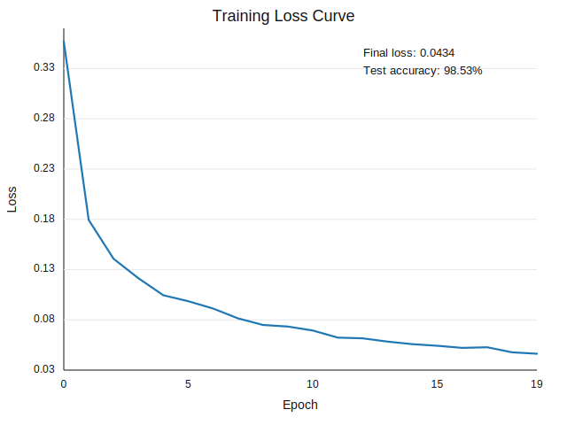

# MNIST 숫자 인식 과제 보고서

## 0. 반·팀원

| 항목 | 내용 |
| --- | --- |
| 반 | 301 |
| 팀명 | 6조 |
| 팀원 | 김규태, 김세인, 김정환, 김현옥 |

---

## 1. 실험 목적

본 과제의 목적은 PyTorch, TensorFlow 같은 딥러닝 프레임워크를 사용하지 않고 NumPy만으로 MNIST 손글씨 숫자 분류 신경망을 구현하는 것이다.

현재 구현은 Affine 계층, ReLU, Softmax, Cross Entropy Loss, Batch Normalization, Dropout, Adam optimizer, 학습 루프, 평가 함수까지 직접 작성한 구조이다. `evaluate(model, x, y)`를 통해 테스트 정확도와 총 파라미터 수를 확인하며, 목표 정확도는 95% 이상이다.

---

## 2. 모델 구조

현재 `src/network.py`의 `NeuralNetwork` 구현 기준 모델 구조는 다음과 같다.

| 항목 | 내용 |
| --- | --- |
| 입력층 | 784차원 입력, 28x28 MNIST 이미지를 펼친 벡터 |
| 은닉층 수 | 2개 |
| 은닉층 차원 | 512, 256 |
| 출력층 | 10차원 출력, 숫자 0~9 분류 |
| 활성화 함수 | ReLU |
| BatchNorm | `use_batchnorm=True`일 때 각 은닉층 뒤에 적용 |
| Dropout | `use_dropout=True`일 때 각 은닉층 뒤에 적용 |
| Dropout 비율 | 기본값 `0.5` |
| 출력 처리 | 마지막 Affine 출력 뒤 Softmax 적용 |

```text
Input(784)
-> Affine(512) -> BatchNorm -> ReLU -> Dropout(0.5)
-> Affine(256) -> BatchNorm -> ReLU -> Dropout(0.5)
-> Affine(10)
-> Softmax
```

`predict()`에서는 `train=False`로 forward를 수행하여 BatchNorm과 Dropout이 추론 모드로 동작한다.

---

## 3. 학습 설정

현재 `mnist_lab.ipynb`, `src/training.py`, `src/optimizers.py` 기준 학습 설정은 다음과 같다.

| 항목 | 값 |
| --- | --- |
| Optimizer | Adam |
| Learning rate | 0.001 |
| Adam beta1 | 0.9 |
| Adam beta2 | 0.999 |
| Adam eps | 1e-8 |
| Epochs | 20 |
| Batch size | 128 |
| 손실 함수 | Cross Entropy Loss |
| BatchNorm momentum | 0.9 |
| 가중치 초기화 | He initialization |
| Bias 초기화 | 0 |
| BatchNorm 초기화 | `gamma=1`, `beta=0` |

학습 루프는 매 epoch마다 학습 데이터를 무작위로 섞은 뒤 미니배치 단위로 forward, loss 계산, backward, optimizer update를 수행한다.

---

## 4. 실험 환경

| 항목 | 내용 |
| --- | --- |
| 실행 환경 | 로컬 또는 Google Colab CPU |
| Python | Python 3.11 기준 |
| 주요 라이브러리 | NumPy, Matplotlib |
| 데이터셋 | MNIST, `data/mnist.npz` |
| 학습 시간 | 현재 저장된 실행 결과 없음. Colab CPU 또는 로컬에서 실행 후 기록 필요 |

---

## 5. 결과

현재 코드에서 확정할 수 있는 결과와 실행 후 기록해야 하는 결과는 다음과 같다.

| 항목 | 값 |
| --- | --- |
| 총 파라미터 수 | 537,354 |
| Train loss | lr=0.1: 0.4703 -> 0.1900, lr=0.01: 0.2831 -> 0.0572, lr=0.001: 0.4090 -> 0.0445, lr=0.0016: 0.3519 -> 0.0413 |
| Test accuracy | lr=0.1: 97.69%, lr=0.01: 98.33%, lr=0.001: 98.46%, lr=0.0016: 측정값 미기록 |
| 목표 정확도 | 95% 이상 |
| 권장 정확도 | 97% 이상 |

총 파라미터 수 계산은 다음과 같다.

| 파라미터 | 개수 |
| --- | ---: |
| W1, b1 | 784 x 512 + 512 = 401,920 |
| W2, b2 | 512 x 256 + 256 = 131,328 |
| W3, b3 | 256 x 10 + 10 = 2,570 |
| BatchNorm gamma/beta | 512 + 512 + 256 + 256 = 1,536 |
| 합계 | 537,354 |

### Learning rate별 training loss 비교

아래 그래프는 learning rate를 `0.1`, `0.01`, `0.001`로 바꾸었을 때의 20 epoch 학습 손실 곡선이다. 세 그래프는 비교가 쉽도록 같은 loss 축 범위로 삼등분 배치했다.


추가로 `lr=0.0016` 설정에서 측정한 training loss 곡선은 다음과 같다.



| Learning rate | Epoch 1 loss | Epoch 20 loss | Loss 감소율 | Test accuracy | 관찰 내용 |
| --- | ---: | ---: | ---: | ---: | --- |
| 0.1 | 0.4703 | 0.1900 | 59.6% | 97.69% | 목표 정확도는 넘었지만 최종 loss가 가장 높고 후반부에서 감소가 둔화됨 |
| 0.01 | 0.2831 | 0.0572 | 79.8% | 98.33% | loss가 안정적으로 감소했고 권장 정확도 97%를 넘김 |
| 0.001 | 0.4090 | 0.0445 | 89.1% | 98.46% | 기록된 실험 중 test accuracy가 가장 높음 |
| 0.0016 | 0.3519 | 0.0413 | 88.3% | 98.53% | 최종 train loss가 가장 낮게 나타남 |

Epoch별 loss 기록은 다음과 같다.

| Epoch | lr=0.1 | lr=0.01 | lr=0.001 | lr=0.0016 |
| ---: | ---: | ---: | ---: | ---: |
| 1 | 0.4703 | 0.2831 | 0.4090 | 0.3519 |
| 2 | 0.3433 | 0.1644 | 0.1935 | 0.1744 |
| 3 | 0.3135 | 0.1352 | 0.1469 | 0.1357 |
| 4 | 0.2787 | 0.1197 | 0.1276 | 0.1163 |
| 5 | 0.2680 | 0.1146 | 0.1110 | 0.0994 |
| 6 | 0.2590 | 0.1026 | 0.0978 | 0.0935 |
| 7 | 0.2430 | 0.0908 | 0.0900 | 0.0862 |
| 8 | 0.2370 | 0.0901 | 0.0813 | 0.0764 |
| 9 | 0.2279 | 0.0837 | 0.0770 | 0.0699 |
| 10 | 0.2169 | 0.0832 | 0.0716 | 0.0683 |
| 11 | 0.2155 | 0.0793 | 0.0623 | 0.0644 |
| 12 | 0.2143 | 0.0742 | 0.0638 | 0.0573 |
| 13 | 0.2081 | 0.0733 | 0.0594 | 0.0566 |
| 14 | 0.2044 | 0.0709 | 0.0563 | 0.0534 |
| 15 | 0.2039 | 0.0680 | 0.0539 | 0.0508 |
| 16 | 0.1965 | 0.0629 | 0.0500 | 0.0492 |
| 17 | 0.1948 | 0.0652 | 0.0502 | 0.0471 |
| 18 | 0.1866 | 0.0604 | 0.0449 | 0.0477 |
| 19 | 0.1878 | 0.0588 | 0.0468 | 0.0427 |
| 20 | 0.1900 | 0.0572 | 0.0445 | 0.0413 |

### Learning rate 비교 결과

네 실험은 모델 구조와 총 파라미터 수가 동일하므로, 차이는 learning rate 설정에 따른 학습 양상으로 볼 수 있다. `lr=0.1`은 테스트 정확도 97.69%로 목표 정확도 95%를 넘었지만, 최종 loss가 0.1900으로 다른 설정보다 높고 후반부에서 loss가 거의 정체되었다. 학습률이 커서 빠르게 이동하지만 세밀한 수렴에는 불리한 설정으로 해석된다.

`lr=0.01`은 테스트 정확도 98.33%를 기록했고, 최종 loss도 0.0572까지 낮아져 안정적인 학습 결과를 보였다. `lr=0.001`은 최종 train loss가 0.0445로 `lr=0.01`보다 낮고, test accuracy도 98.46%로 기록된 실험 중 가장 높았다. 따라서 정확도까지 확인된 결과만 기준으로 하면 `lr=0.001`이 가장 좋은 설정이다.

`lr=0.0016`은 최종 train loss가 0.0413으로 가장 낮게 나타났지만, test accuracy가 함께 기록되지 않았으므로 일반화 성능까지 가장 좋다고 단정할 수는 없다. 또한 최종 loss가 더 낮다고 해서 test accuracy가 항상 더 높아지는 것은 아니다. Loss는 정답 클래스에 부여한 확률의 크기까지 반영하지만, accuracy는 최종 예측 클래스가 정답과 같은지만 판단한다. 따라서 train loss가 낮아져도 일부 test 샘플의 argmax가 달라지면 accuracy는 더 낮게 나올 수 있다.

### Dropout 적용 전후 정확도 비교

현재 최종 모델은 `use_dropout=True`, `dropout_ratio=0.5`를 사용한다. Dropout 비교 실험을 수행할 경우 아래 표에 결과를 기록한다.

| 설정 | Test accuracy | 관찰 내용 |
| --- | ---: | --- |
| Dropout 미적용 | 실행 후 기록 | 과적합 여부 확인 |
| Dropout 0.5 적용 | 실행 후 기록 | 현재 기본 설정 |

---

## 6. 회고

현재 구현은 NumPy만 사용해 신경망의 핵심 구성 요소를 직접 작성했다는 점에서 과제 요구사항에 맞는다. Affine 계층의 forward/backward, BatchNorm의 학습/추론 모드, Dropout의 학습/추론 모드, Softmax와 Cross Entropy 기반 gradient 흐름, Adam optimizer의 파라미터 업데이트 과정을 코드로 확인할 수 있다.

모델은 `784 -> 512 -> 256 -> 10` 구조로 구성되어 있으며, BatchNorm을 통해 학습 안정성을 높이고 Dropout을 통해 과적합을 줄이도록 설계했다. Learning rate 비교 결과 `lr=0.1`은 목표 정확도는 넘었지만 loss가 높게 남았고, `lr=0.001`은 98.46%로 기록된 실험 중 가장 높은 테스트 정확도를 보였다. `lr=0.0016`은 최종 train loss가 0.0413으로 가장 낮았지만 test accuracy가 아직 기록되지 않았으므로, 최종 설정을 확정하려면 해당 정확도를 추가로 측정해야 한다. 이번 비교를 통해 최종 loss와 test accuracy는 관련이 있지만 반드시 같은 순서로 좋아지는 지표는 아니라는 점도 확인할 수 있다.
